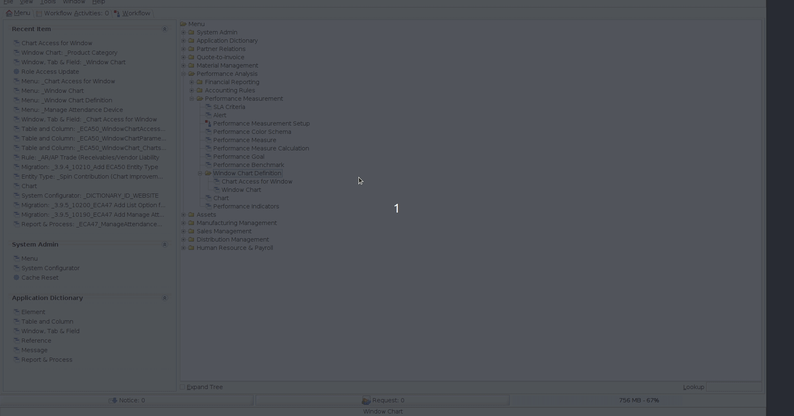

# ADempiere Template Project

A improvement for dashboard using ADempiere new UI.

## Examples

### Definition


### Access



## Requirements
- [JDK 11 or later](https://adoptium.net/)
- [Gradle 8.0.1 or later](https://gradle.org/install/)


### Packages Names
All packages are created with `org.spin.eca50` preffix.

```Java
org.spin.eca50.model.validator
org.spin.eca50.setup
org.spin.eca50.util
```

### Model Validators
Change the `org.spin.eca50.model.validator.Validator` by your implementation, example: `org.spin.eca50.model.validator.MyOwnFunctionality`

### Model Deploy class
Change the `org.spin.eca50.setup.Deploy` by your implementation, example: `org.spin.eca50.setup.MyOwnSetupForDeploy`

### Model Util class for core changes
Change the `org.spin.eca50.util.Changes` by your implementation, example: `org.spin.eca50.util.MyOwnChanges`

## Binary Project

You can get all binaries from github [here](https://central.sonatype.com/artifact/io.github.adempiere/adempiere-dashboard-improvements/1.0.0).

All contruction is from github actions


## Some XML's:

All dictionary changes are writing from XML and all XML's hare `xml/migration`


## How to add this library?

Is very easy.

- Gradle

```Java
implementation 'io.github.adempiere:adempiere-dashboard-improvements:1.0.0'
```

- SBT

```
libraryDependencies += "io.github.adempiere" % "adempiere-dashboard-improvements" % "1.0.0"
```

- Apache Maven

```
<dependency>
    <groupId>io.github.adempiere</groupId>
    <artifactId>adempiere-dashboard-improvements</artifactId>
    <version>1.0.0</version>
</dependency>
```